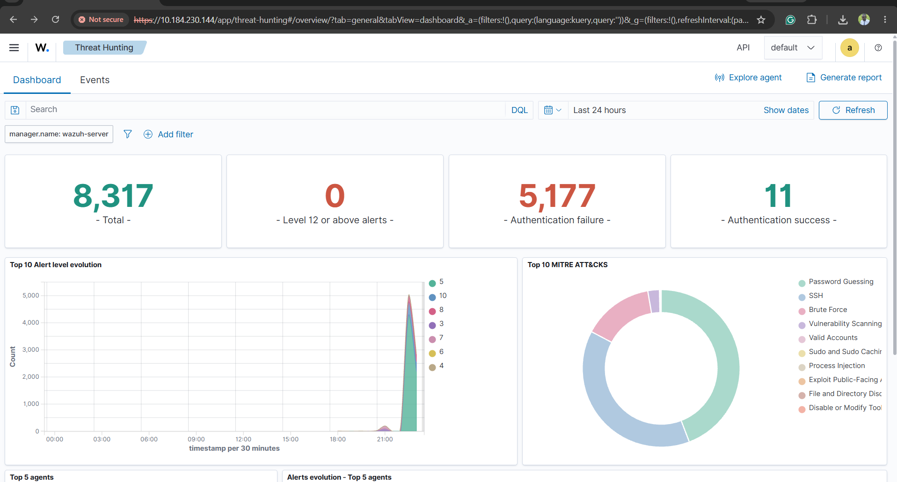

# Week 1: Cyber Range Setup & Telemetry Monitoring

## Overview
Configured a dual-node environment to simulate an offensive brute-force attack from a bare-metal Kali Linux host against a virtualized Metasploitable target, capturing real-time telemetry using the Wazuh SIEM dashboard.

---

## 1. Execution Telemetry

| Telemetry Metric | Ingested Count | SOC Context & Interpretation |
| :--- | :--- | :--- |
| **Total Events Ingested** | 8,317 | Total operational logs captured across system components during execution. |
| **Authentication Failures** | 5,177 | Spike caused by automated credential guessing attempts. |
| **Authentication Successes** | 11 | Successful logons recorded during credential testing. |
| **High Severity (L12+) Alerts** | 0 | Standard brute-force rules fired within medium severity thresholds. |

---

## 2. Visual Evidence & Incident Timeline

### Incident Findings
* **Temporal Spike:** A distinct anomaly occurred around 22:00, where authentication failure logs surged above 5,000 attempts within 30 minutes.
* **MITRE ATT&CK Mapping:**
  * **T1110 (Brute Force / Password Guessing):** Primary attack behavior detected and classified by Wazuh.
  * **T1021.004 (Remote Services - SSH):** Protocol target identified during execution.

---

## 3. Core Lessons Learned
1. **Log Collection Fundamentals:** System events provide the baseline metric needed to differentiate normal network behavior from active attacks.
2. **Correlation:** Combining a high volume of failed logins immediately followed by successful logins highlights potential account compromise for security analysts.
